# PolicyC

PolicyC is a polyglot research system for testing whether a task-specific slice of a large policy prompt can preserve the behaviorally relevant obligations of the full policy while using less context.

It deliberately separates two concerns:

- TypeScript is the single authority for policy loading, validation, matching, graph closure, candidate construction, prompt emission, hashing, and artifact serialization.
- Python owns repeated model trials, bounded concurrency, rate limiting, retries, timeouts, cancellation, streamed events, persistence, evaluation, statistics, and baseline comparison.

PolicyC does **not** currently prove behavioral equivalence. Its included end-to-end demo uses a deterministic fake provider to verify runtime mechanics. A real OpenAI adapter is available only when explicitly configured with credentials.

## Architecture

```mermaid
flowchart LR
    P["YAML policy packs"] --> V["Zod runtime validation"]
    V --> G["Graph validation"]
    X["Request + artifact context"] --> S["Deterministic selector"]
    G --> S
    S --> C["Five candidate strategies"]
    C --> A["Versioned JSON artifacts + hashes"]
    A --> M["Run manifest"]
    M --> R["Python asyncio runtime"]
    R --> Q["Bounded worker queue + rate limiter"]
    Q --> F["Fake or OpenAI provider"]
    F --> E["Rule-based evaluator"]
    E --> O["Atomic trials + JSONL/SSE events + report"]
```



The protocol boundary is defined by JSON Schemas under [`protocol/`](protocol/). Python validates TypeScript artifacts and verifies candidate and compiled-prompt hashes before execution.

## Compiler pipeline

The compiler loads 39 manually structured policy nodes from six YAML packs. PolicyC does not yet extract those nodes from arbitrary natural-language prompts.

1. Zod validates required fields, enums, priorities, triggers, and unknown fields.
2. Graph validation rejects duplicate IDs/edges, missing references, self-dependencies, cycles, unreachable structural nodes, unknown validators, and invalid always-active configurations.
3. Regex intent detection and structured artifact context select seed policies.
4. Queue-based traversal adds the transitive `requires` closure.
5. Policies are ordered deterministically and emitted as a runtime prompt.
6. The compiler serializes five experimental candidates:
   - `full_policy`
   - `compiler_slice`
   - `kernel_only`
   - `direct_matches`
   - `conservative_expanded`

Candidate names describe construction strategies, not behavioral equivalence.

## Python runtime

The Python package lives in [`runtime/python`](runtime/python) and targets Python 3.12+.

The scheduler creates a fixed number of worker tasks and feeds them through a bounded queue. A second semaphore enforces provider-specific concurrency. An in-process sliding-window limiter can constrain requests and estimated prompt tokens. Each invocation has a timeout; retryable failures use exponential backoff with deterministic jitter and optional provider `Retry-After` values.

Trial IDs are hashes of stable run, provider, model, candidate, and sample inputs. Completed trials are written atomically and reused after restart when their provenance hash matches. Incomplete and retryable trials execute again. Cancellation propagates to active provider tasks.

Events receive a per-run monotonic sequence number, persist as JSONL, and serialize as SSE. FastAPI provides:

- `POST /runs`
- `GET /runs/{run_id}`
- `GET /runs/{run_id}/events`
- `POST /runs/{run_id}/cancel`
- `GET /runs/{run_id}/report`

Raw response retention is explicit in each manifest: `none`, `text`, or `full`. Secrets are never written by the runtime.

## Research question and evaluation

> Given a large system prompt P and a user request x, can we compile P into a much smaller active policy subset Pₓ such that a model using Pₓ preserves the same critical obligations as a model using the full prompt P?

Structural evidence and behavioral evidence are kept separate.

Structural evaluation covers selected-policy precision/recall, critical-policy recall, dependency completeness, graph validity, deterministic artifact construction, and exact or estimated token counts.

The v2 paired path evaluates the full-policy and compiler-slice responses for each case against the same independently authored case obligations, prohibitions, refusal expectation, tool expectation, and rubric. Obligations never come from the candidate being judged. Reports expose both-pass, both-fail, full-pass/compiled-fail, and compiled-pass/full-fail pairs, exact obligation regressions, severe failures, Wilson intervals, and descriptive McNemar analysis. Selector metrics are structural metrics, not behavioral metrics.

The built-in evaluator is intentionally small and deterministic. Model graders can be added as adapters, but should not be treated as ground truth.

## Setup

```bash
pnpm install
pnpm build

python3.12 -m venv .venv
.venv/bin/pip install -e 'runtime/python[dev]'
```

The local environment may use a newer Python, but CI verifies Python 3.12.

## CLI

Existing commands remain available:

```bash
pnpm policyc select --input "what's the latest OpenAI news?"
pnpm policyc compile --input "rewrite this email professionally"
pnpm policyc inspect --policy current_info_requires_web
pnpm policyc eval
```

Generate cross-language experiment artifacts:

```bash
node dist/cli.js compile-candidates \
  --input "what's the latest OpenAI news?" \
  --output experiment \
  --model fake-v1
```

Run and stream an offline experiment:

```bash
.venv/bin/policyc-runtime run experiment/manifest.json
```

Or run the complete demo:

```bash
pnpm demo
```

The demo compiles five candidates, executes three samples per candidate with maximum concurrency four, streams SSE-compatible events, atomically persists 15 trial results, and produces `report.json`. Its compliance results are fake-provider evidence only.

## Safe paired OpenAI experiments

The supported entry point compiles only the requested strategies, validates the cases and fixed model pricing, creates one full-policy baseline per case, and delegates scheduling to Python. The default provider is `fake`; unknown providers fail closed. The pinned smoke model is `gpt-5-mini-2025-08-07`, using the versioned registry at `pricing/openai-v1.json`.

Dry-run the one-case experiment without a key or network access:

```bash
pnpm policyc experiment \
  --cases eval/behavioral/smoke-v1.jsonl \
  --strategies full_policy,compiler_slice \
  --provider openai \
  --model gpt-5-mini-2025-08-07 \
  --samples 1 --concurrency 1 \
  --max-output-tokens 256 --max-calls 2 \
  --max-cost-usd 0.02 --retries 0 \
  --run-label smoke-1 \
  --output runs/openai-smoke --dry-run
```

The dry run validates every provider payload and prints the exact paid command. To execute later, export `OPENAI_API_KEY`, remove `--dry-run`, and either type the displayed `RUN <run-id>` confirmation or deliberately add `--yes` for non-interactive execution. Keys are read from the environment and are never persisted.

Hard limits cover logical trials, provider attempts, cumulative input tokens, cumulative output tokens, dollar exposure, fixed model, and per-call output tokens. Checks run before the experiment, before every attempt, after returned usage, after retries, and on resume. Pricing includes standard input, cached input, and output; missing usage fails closed rather than becoming zero. `seed` is not sent.

Raw HTTP responses are atomically persisted before parsing and evaluation. Completed provider calls resume without another call. A timeout or transport disconnect is recorded as an ambiguous paid attempt, consumes call and worst-case cost exposure, and is not retried unless `--retry-ambiguous` was explicitly selected. This mitigates duplicate billing but cannot provide exactly-once semantics across an uncertain network boundary.

The 20-case pilot shape is:

```bash
pnpm policyc experiment \
  --cases eval/behavioral/held-out-pilot-v1.jsonl \
  --strategies full_policy,compiler_slice \
  --provider openai \
  --model gpt-5-mini-2025-08-07 \
  --samples 3 --concurrency 2 \
  --max-output-tokens 256 --max-calls 120 \
  --max-cost-usd 0.50 --retries 0 \
  --output runs/openai-pilot --dry-run
```

### Dataset discipline

Use `development-v1.jsonl` for iteration, freeze compiler and cases, then run the versioned held-out set once. Every manifest persists the split, version, and canonical hash; edits or relabeling cause validation failure. Export discovered failures to a separate development file rather than rewriting held-out inputs. `adversarial-template-v1.jsonl` is intentionally non-executable until independently authored cases replace its template row.

### Blinded grading

Every v2 run writes `blind/grading-packets.json` with opaque answer IDs and deterministically randomized answer order. It omits strategy names and token counts. The private mapping is stored separately as `blind/answer-map.private.json`. Manual grading requires no paid grader; any later model-grader result is evidence, not ground truth.

### Persistent run catalog

PolicyC maintains a local SQLite catalog at `.policyc/catalog.sqlite`. It records run status, Git commit and dirty state, manifest and dataset hashes, model, trial counts, calls, token usage, costs, failures, and paths to the authoritative run files.

```bash
pnpm policyc runs list
pnpm policyc runs list --json
pnpm policyc runs show <run-id>
pnpm policyc runs rebuild --root runs
```

The database persists across process restarts and is ignored by Git. Back up `.policyc/catalog.sqlite` together with `runs/` if you want the history on another machine. The run directories remain the scientific source of truth; if the SQLite file is lost, `runs rebuild` recreates the catalog from their manifests, trials, budgets, and reports.

Repeated invocations with the same experiment configuration and output directory reuse the same run ID and completed trials. Reusing an output directory with an incompatible configuration is rejected instead of silently starting a different run.

Terminal provider failures are preserved and never silently replayed. After correcting an external problem such as unavailable quota, start a distinct attempt with a new output directory and explicit identity, for example `--run-label smoke-2`. This retains the failed run and creates a separate catalog record.

## Verification

```bash
pnpm typecheck
pnpm test
pnpm graph:validate

pnpm py:format
pnpm py:lint
pnpm py:typecheck
pnpm py:test

pnpm test:all
```

CI installs both environments, builds TypeScript, validates the graph and cross-language artifacts, runs all offline tests, and executes the fake-provider demo without credentials.

## Token accounting

Modern OpenAI-family models use exact `o200k_base` BPE counts through `gpt-tokenizer`. Unsupported model names use the documented whitespace estimator `ceil(words / 0.75)`. Every artifact records `tokens`, `method`, `tokenizer`, and `model`; reports never silently mix estimated and exact values.

## Persistence layout

```text
experiment/
  manifest.json                 # input manifest
  artifacts/*.json              # compiler candidates
  manifest.canonical.json       # normalized run configuration
  environment.json              # environment and reproduction command
  events.jsonl                  # ordered run events
  trials/<trial-id>.json        # atomic individual results
  report.json                   # aggregate comparison
```

V2 runs additionally contain `raw/<trial>/attempt-*.json`, parsed `provider/*.json`, independent `evaluations/*.json`, `budget.json`, and the two blind-review files.

## Known limitations

- Policy nodes and dependency edges are manually authored; prompt-to-IR extraction is not implemented.
- Intent detection is lexical and can miss paraphrases.
- The existing 157-case selector evaluation is repository-authored, not held out.
- The deterministic evaluator uses regular expressions and is not a complete judge of model behavior.
- The 20-case held-out pilot is small and repository-authored; it supports a disciplined first pilot, not broad external validity.
- The fake provider validates scheduling and reproducibility, not policy preservation.
- The OpenAI adapter is contract-tested against mocked documented shapes but has not yet been verified by a live call.
- Network ambiguity prevents guaranteed exactly-once billing; PolicyC stops by default and surfaces the exposure.
- Real-provider results require repeated trials and careful interpretation; no single run proves equivalence.
- The API is an in-process research service, not a distributed production control plane.
