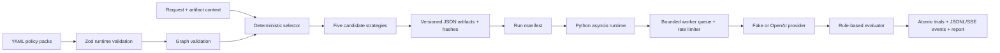

# PolicyC

PolicyC is a polyglot research system for testing whether a task-specific slice of a large policy prompt can preserve the behaviorally relevant obligations of the full policy while using less context.

It deliberately separates two concerns:

- TypeScript is the single authority for policy loading, validation, matching, graph closure, candidate construction, prompt emission, hashing, and artifact serialization.
- Python owns repeated model trials, bounded concurrency, rate limiting, retries, timeouts, cancellation, streamed events, persistence, evaluation, statistics, and baseline comparison.

PolicyC does **not** currently prove behavioral equivalence. Its included end-to-end demo uses a deterministic fake provider to verify runtime mechanics. A real OpenAI adapter is available only when explicitly configured with credentials.

## Architecture


```mermaid
flowchart LR
    P["YAML policy packs"] --> V["Zod runtime validation"]
    V --> G["Graph validation"]
    X["Request + artifact context"] --> S["Deterministic selector"]
    G --> S
    S --> C["Five candidate strategies"]
    C --> A["Versioned JSON artifacts + hashes"]
    A --> M["Run manifest"]
    M --> R["Python asyncio runtime"]
    R --> Q["Bounded worker queue + rate limiter"]
    Q --> F["Fake or OpenAI provider"]
    F --> E["Rule-based evaluator"]
    E --> O["Atomic trials + JSONL/SSE events + report"]
```

The protocol boundary is defined by JSON Schemas under [`protocol/`](protocol/). Python validates TypeScript artifacts and verifies candidate and compiled-prompt hashes before execution.

## Compiler pipeline

Compiler 0.9 (unfrozen, development) loads 43 manually structured policy nodes from six YAML packs. Its authorization read sits behind an injectable, schema-validated reader boundary; the shipped reader is a deterministic baseline whose blind-paraphrase recall is recorded in `eval/audits/compiler-v0.9-development.md`. PolicyC does not yet extract those nodes from arbitrary natural-language prompts.

1. Zod validates required fields, enums, priorities, triggers, and unknown fields.
2. Graph validation rejects duplicate IDs/edges, missing references, self-dependencies, cycles, unreachable structural nodes, unknown validators, and invalid always-active configurations.
3. Regex intent detection and structured artifact context select seed policies.
4. Queue-based traversal adds the transitive `requires` closure.
5. Specialization evaluates each selected node's authored predicate against the request and context. Compiler 0.8 has one predicate, `explicit_confirmation`. It holds when one sentence of the request contains the user's own first-person confirmation of the operation the context declares, with no negation, reported speech, or conditional, and that sentence names every field the full policy requires for the artifact and operation. Then the node's `satisfied` branch replaces its ask-for-confirmation instruction. Anything less leaves the node as authored. Selection never changes, and the artifact records a `specializations` trace with the evidence.
6. Policies are ordered deterministically and emitted as a runtime prompt.
7. The compiler serializes five experimental candidates:
   - `full_policy`
   - `compiler_slice`
   - `kernel_only`
   - `direct_matches`
   - `conservative_expanded`

Candidate names describe construction strategies, not behavioral equivalence.

## Python runtime

The Python package lives in [`runtime/python`](runtime/python) and targets Python 3.12+.

The scheduler creates a fixed number of worker tasks and feeds them through a bounded queue. A second semaphore enforces provider-specific concurrency. An in-process sliding-window limiter can constrain requests and estimated prompt tokens. Each invocation has a timeout; retryable failures use exponential backoff with deterministic jitter and optional provider `Retry-After` values.

Trial IDs are hashes of stable run, provider, model, candidate, and sample inputs. Completed trials are written atomically and reused after restart when their provenance hash matches. Incomplete and retryable trials execute again. Cancellation propagates to active provider tasks.

Events receive a per-run monotonic sequence number, persist as JSONL, and serialize as SSE. FastAPI provides:

- `POST /runs`
- `GET /runs/{run_id}`
- `GET /runs/{run_id}/events`
- `POST /runs/{run_id}/cancel`
- `GET /runs/{run_id}/report`

Raw response retention is explicit in each manifest: `none`, `text`, or `full`. Secrets are never written by the runtime.

## Research question and evaluation

> Given a large system prompt P and a user request x, can we compile P into a much smaller active policy subset Pₓ such that a model using Pₓ preserves the same critical obligations as a model using the full prompt P?

Structural evidence and behavioral evidence are kept separate.

Structural evaluation covers selected-policy precision/recall, critical-policy recall, dependency completeness, graph validity, deterministic artifact construction, and exact or estimated token counts.

The paired path evaluates the full-policy and compiler-slice responses for each case against the same independently authored case obligations, prohibitions, refusal expectation, tool expectation, and rubric. Obligations never come from the candidate being judged. Reports expose both-pass, both-fail, full-pass/compiled-fail, and compiled-pass/full-fail pairs, exact obligation regressions, severe failures, Wilson intervals, and descriptive McNemar analysis. Selector metrics are structural metrics, not behavioral metrics.

The built-in evaluator is intentionally small and deterministic. Model graders can be added as adapters, but should not be treated as ground truth.

### Latest frozen result

Compiler 0.8 did not pass its preregistered held-out-v4 test. In 360 GPT-5 mini executions over 60 independently authored cases (339 completed, 163 complete pairs), exhaustive strategy-blind semantic review measured 100 both-pass, 32 full-only, 11 compiler-only, and 20 both-fail pairs. Conditional critical-obligation preservation was 100/132 = **75.76%** (Wilson 95%: 67.79%--82.27%), versus the 95% target, across 17 regressed cases. The compiler reduced mean actual input tokens by **94.76%**, uncached-equivalent cost by **66.00%**, and billed cost by **18.03%**. The run cost **$1.0653**. Compiler 0.8's confirmation specialization matched none of the four act-side confirmation cases the authors wrote, so on fresh data its behavior was identical to compiler 0.7; the largest failure class was calling a tool the user had asked not to use (14 of 32 regressions). See [`eval/audits/held-out-v4-execution.md`](eval/audits/held-out-v4-execution.md).

The prior result, compiler 0.7 on held-out-v3, was 130/163 = 79.75% preservation with 93.75% input reduction (`eval/audits/held-out-v3-execution.md`). The two sets differ, so the versions are not a controlled comparison.

## Setup

```bash
pnpm install
pnpm build

python3.12 -m venv .venv
.venv/bin/pip install -e 'runtime/python[dev]'
```

The local environment may use a newer Python, but CI verifies Python 3.12.

## CLI

Existing commands remain available:

```bash
pnpm policyc select --input "what's the latest OpenAI news?"
pnpm policyc compile --input "rewrite this email professionally"
pnpm policyc inspect --policy current_info_requires_web
pnpm policyc eval
```

Run the complete offline demo:

```bash
pnpm demo
```

The demo runs the one-case `smoke-v1` dataset through `full_policy` and `compiler_slice` with the deterministic fake provider, writes the run under `demo-run/`, and produces `report.json`. Its compliance results are fake-provider evidence only. The older `compile-candidates` command is removed; every experiment goes through `policyc experiment` with explicit strategies, samples, provider, model, and budgets.

## Safe paired OpenAI experiments

The supported entry point compiles only the requested strategies, validates the cases and fixed model pricing, creates one full-policy baseline per case, and delegates scheduling to Python. The default provider is `fake`; unknown providers fail closed. The pinned smoke model is `gpt-5-mini-2025-08-07`, using the versioned registry at `pricing/openai-v2.json`, which also prices built-in web search. The derived input-token ceiling counts each call's prompt, request, and function-schema tokens plus 10% margin; `--max-input-tokens` overrides it.

Dry-run the one-case experiment without a key or network access:

```bash
pnpm policyc experiment \
  --cases eval/behavioral/smoke-v1.jsonl \
  --strategies full_policy,compiler_slice \
  --provider openai \
  --model gpt-5-mini-2025-08-07 \
  --samples 1 --concurrency 1 \
  --max-output-tokens 1024 --max-calls 2 \
  --max-cost-usd 0.02 --retries 0 \
  --run-label smoke-1 \
  --output runs/openai-smoke --dry-run
```

The dry run validates every provider payload and prints the exact paid command. To execute later, export `OPENAI_API_KEY`, remove `--dry-run`, and either type the displayed `RUN <run-id>` confirmation or deliberately add `--yes` for non-interactive execution. Keys are read from the environment and are never persisted.

Hard limits cover logical trials, provider attempts, cumulative input tokens, cumulative output tokens, dollar exposure, fixed model, and per-call output tokens. Checks run before the experiment, before every attempt, after returned usage, after retries, and on resume. Pricing includes standard input, cached input, and output; missing usage fails closed rather than becoming zero. `seed` is not sent.

Raw HTTP responses are atomically persisted before parsing and evaluation. Completed provider calls resume without another call. The manifest embeds the Git commit and dirty state used to construct the run, and the SQLite catalog retains the same provenance. A timeout or transport disconnect is recorded as an ambiguous paid attempt, consumes call and worst-case cost exposure, and is not retried unless `--retry-ambiguous` was explicitly selected. This mitigates duplicate billing but cannot provide exactly-once semantics across an uncertain network boundary.

Pricing registry v2 also reserves and records OpenAI built-in web-search fees. Web-enabled responses set `max_tool_calls: 1` and `search_context_size: low`; reports separate built-in call counts and tool cost. OpenAI documents that search context size does not guarantee an exact token count, so retrieved search-content tokens are charged from actual provider usage and can overshoot the pre-call token estimate for the in-flight request. Treat the configured ceiling as a scheduler ceiling with bounded per-search fees, not an external billing-account guarantee, whenever built-in search is enabled.

The 20-case pilot shape is:

```bash
pnpm policyc experiment \
  --cases eval/behavioral/pilot-v2.jsonl \
  --strategies full_policy,compiler_slice \
  --provider openai \
  --model gpt-5-mini-2025-08-07 \
  --samples 3 --concurrency 2 \
  --max-output-tokens 1024 --max-calls 120 \
  --max-cost-usd 0.55 --retries 0 \
  --run-label pilot-v2 \
  --output runs/openai-pilot-v2 --dry-run
```

### Dataset discipline

Use `development-v1.jsonl` for iteration, freeze compiler and cases, then run a versioned evaluation set once. `pilot-v2.jsonl` is a development-informed pilot, not a held-out set; its preregistration and the rejected v1 audit live under `eval/`. Every manifest persists the split, version, and canonical hash; edits or relabeling cause validation failure. Export discovered failures to a separate development file rather than rewriting evaluated inputs. `adversarial-template-v1.jsonl` is intentionally non-executable until independently authored cases replace its template row.

Confirmed compiler 0.5 held-out failures were copied—not moved or edited—into `eval/behavioral/compiler-v0.6-regression-v1.jsonl` as a nine-case development-only regression set. Its 18-call compiler 0.6 smoke produced eight both-pass pairs and one compiler-only pass under strategy-blind grading, with no compiler regressions. This is targeted development evidence, never fresh held-out evidence; the complete audit is in `eval/audits/compiler-v0.6-development-smoke.md`.

The six redundant-confirmation regressions from held-out-v3 (hv3-007, 010, 047, 051, 053, 058) were copied the same way into `eval/behavioral/compiler-v0.8-regressions.jsonl` as the compiler 0.8 development set. Offline tests in `test/compiler.test.ts` assert that 0.8 specializes each of them and that fifteen negative controls still ask. The 12-call Phase F smoke (`run_b9daf24a2c394e8d`, $0.0173) saw every compiled execution call the confirmed tool with exact arguments instead of re-asking; it is adapter and resume evidence on spent cases, not a preservation estimate. See `eval/audits/compiler-v0.8-smoke.md`.

### Blinded grading

Every v2 run writes `blind/grading-packets.json` with opaque answer IDs and deterministically randomized answer order. It omits strategy names and token counts. The private mapping is stored separately as `blind/answer-map.private.json`. Manual grading requires no paid grader; any later model-grader result is evidence, not ground truth.

Create a smaller reviewer-safe adjudication bundle containing every automated critical regression plus deterministic both-pass and both-fail controls:

```bash
.venv/bin/policyc-runtime adjudication-bundle runs/<run-directory> \
  --agreements-per-class 10
```

The reviewer folder contains enriched critical obligations, opaque answer IDs, and a fillable grade template, but no strategy names, token counts, or selection labels. A hash-linked private selection file stays beside the existing private answer map and must not be shown to the reviewer until grading is final.

To create an exhaustive reviewer-safe bundle containing every complete pair, add `--all-complete`. Lock and commit the completed anonymous grade hashes before opening the private strategy map.

If targeted controls show that the automated agreement strata are unreliable, create a second bundle containing every remaining complete pair without duplicating reviewed packets:

```bash
.venv/bin/policyc-runtime adjudication-completion-bundle runs/<run-directory> \
  --prior-bundle runs/<run-directory>/blind/adjudication-v1 \
  --completed-grades /path/to/grades.completed.json
```

### Persistent run catalog

PolicyC maintains a local SQLite catalog at `.policyc/catalog.sqlite`. It records run status, Git commit and dirty state, manifest and dataset hashes, model, trial counts, calls, token usage, costs, failures, and paths to the authoritative run files.

```bash
pnpm policyc runs list
pnpm policyc runs list --json
pnpm policyc runs show <run-id>
pnpm policyc runs rebuild --root runs
```

The database persists across process restarts and is ignored by Git. Back up `.policyc/catalog.sqlite` together with `runs/` if you want the history on another machine. The run directories remain the scientific source of truth; if the SQLite file is lost, `runs rebuild` recreates the catalog from their manifests, trials, budgets, and reports.

Repeated invocations with the same experiment configuration and output directory reuse the same run ID and completed trials. Reusing an output directory with an incompatible configuration is rejected instead of silently starting a different run.

Completed responses can be regraded offline after a versioned evaluator correction without changing source evidence or making provider calls:

```bash
.venv/bin/python -m policyc_runtime.regrade runs/<run-directory>
```

The independent case evaluator is currently version 2.6.0 (`runtime/python/policyc_runtime/case_evaluator.py`). Evaluator 2.4 introduced recognition of semantically equivalent unavailable-source disclosures and distinguished visual references to an image “background” from first-person promises of asynchronous work; 2.5 corrected refusal wording and 2.6 added the `omits_terms` validator for held-out-v3. Derived regrades remain separate and hash-linked; original manifests, trials, raw responses, evaluations, and reports are immutable.

The command writes a hash-linked addendum, derived report, and derived evaluations under `derived/evaluator-<version>/`. Original manifests, raw responses, trials, evaluations, and reports remain unchanged. Incomplete trials remain failures.

Behavioral evaluator 2.3 applies independently testable universal obligations to every case, including no background-work claims, no hidden-reasoning disclosure, no raw tool traces, and no claimed search/tool action without a recorded tool call. Compiled artifacts also carry explicit tool availability: unavailable required tools become a brief limitation and may never be simulated.

Terminal provider failures are preserved and never silently replayed. After correcting an external problem such as unavailable quota, start a distinct attempt with a new output directory and explicit identity, for example `--run-label smoke-2`. This retains the failed run and creates a separate catalog record.

## Verification

```bash
pnpm typecheck
pnpm test
pnpm graph:validate

pnpm py:format
pnpm py:lint
pnpm py:typecheck
pnpm py:test

pnpm test:all
```

CI installs both environments, builds TypeScript, validates the graph and cross-language artifacts, runs all offline tests, and executes the fake-provider demo without credentials.

## Token accounting

Modern OpenAI-family models use exact `o200k_base` BPE counts through `gpt-tokenizer`. Unsupported model names use the documented whitespace estimator `ceil(words / 0.75)`. Every artifact records `tokens`, `method`, `tokenizer`, and `model`; reports never silently mix estimated and exact values.

## Persistence layout

```text
experiment/
  manifest.json                 # input manifest
  artifacts/*.json              # compiler candidates
  manifest.canonical.json       # normalized run configuration
  environment.json              # environment and reproduction command
  events.jsonl                  # ordered run events
  trials/<trial-id>.json        # atomic individual results
  report.json                   # aggregate comparison
```

V2 runs additionally contain `raw/<trial>/attempt-*.json`, parsed `provider/*.json`, independent `evaluations/*.json`, `budget.json`, and the two blind-review files.

## Known limitations

- Policy nodes and dependency edges are manually authored; prompt-to-IR extraction is not implemented.
- Intent detection is lexical and can miss paraphrases.
- The existing 157-case selector evaluation is repository-authored, not held out.
- The deterministic evaluator uses regular expressions and is not a complete judge of model behavior.
- The 20-case pilot set is small and repository-authored; it is not held out and does not provide broad external validity.
- The fake provider validates scheduling and reproducibility, not policy preservation.
- The OpenAI adapter has executed 960 live model executions in paired experiments across three frozen held-out studies; its contract tests still use mocked documented shapes, and two provider-schema incidents (empty and optional function arguments) were found only under live traffic.
- Network ambiguity prevents guaranteed exactly-once billing; PolicyC stops by default and surfaces the exposure.
- Real-provider results require repeated trials and careful interpretation; no single run proves equivalence.
- The API is an in-process research service, not a distributed production control plane.
